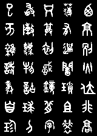
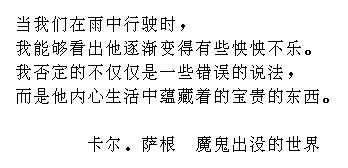

# dot_matrix_font_to_bmp
### 点阵字库到bmp位图的转换工具


这个工具可以用来生成汉字的位图, 也可以把多个水平分辨率或垂直分辨率相同的位图合并成一个。

## 授权协议

dot_matrix_font_to_bmp 在 MIT license协议下发布。参见[LICENSE.md](LICENSE.md)文件。

## 使用方法

编译生成目标文件：

    $ make

所生成的文件有：
* utf8togb2312:	将utf-8编码转换为gb2312编码的程序。
* gb2312tobmps:	从gb2312编码的字符串流生成位图流。
* bmps2bmp:	把位图流的头两个位图水平合并为一个位图，剩余的不处理。
* bmpsall2bmp:	把位图流的所有位图水平合并为一个位图。
* bmpsallv2bmp:	把位图流的所有位图垂直合并为一个位图。
* text2bmp:	接收utf-8编码文本，输出相应位图的程序。

水平合并位图时目前仅支持垂直分辨率一致.
垂直合并位图时目前仅支持水平分辨率一致.

假如你要生成字符串 `字符生成位图测试0x16v1.0.0` 的位图, 执行下面的命令将得到想要的位图, 保存在 `test.bmp`:

    $ ./characters2bmp.sh "字符生成位图测试0x16v1.0.0" > ./test1.bmp


支持中间混杂了空格， 如：

    $ ./characters2bmp.sh "后面有3个空格   前面有3个空格" > ./test2.bmp


指定字库文件：

	$ echo -e '西京别火位非高\n'\
		'薄有遗闻琐且劳\n'\
		'只算初识镜背字\n'\
		'敢陈法物诂球刀\n'\
		'已亥杂诗龚自珍' | \
		./text2bmp -e -F dazhuanti.hzk -H 32 > testdazhuan.bmp



**提示**：上面的`dazhuanti.hzk`(大篆体)字库是用`python`写的一个程序[gendotmatrix](https://github.com/hmgle/gendotmatrix)提取出来的。

直接读入文件并生成相应位图：

```console
$ cat test3.txt
当我们在雨中行驶时，
我能够看出他逐渐变得有些怏怏不乐。
我否定的不仅仅是一些错误的说法，
而是他内心生活中蕴藏着的宝贵的东西。

    卡尔.萨根 魔鬼出没的世界
$ ./text2bmp -g 0xffff -f 0x0 -c 2 -u 16 -d 8 -l 16 -r 8 -i 8 test3.txt > test3.bmp
```

生成的位图：



输入文件编码方式支持 utf-8 和 GBK.

##  用途

它可以用在网络摄像机等嵌入式设备上面. 因为osd叠加功能经常需要的输入格式是位图的, 要设置中文字符叠加到实时码流去的话, 就需要可以动态的接受用户的输入. 可以通过重定向功能将输出流传输到需要的地方.
